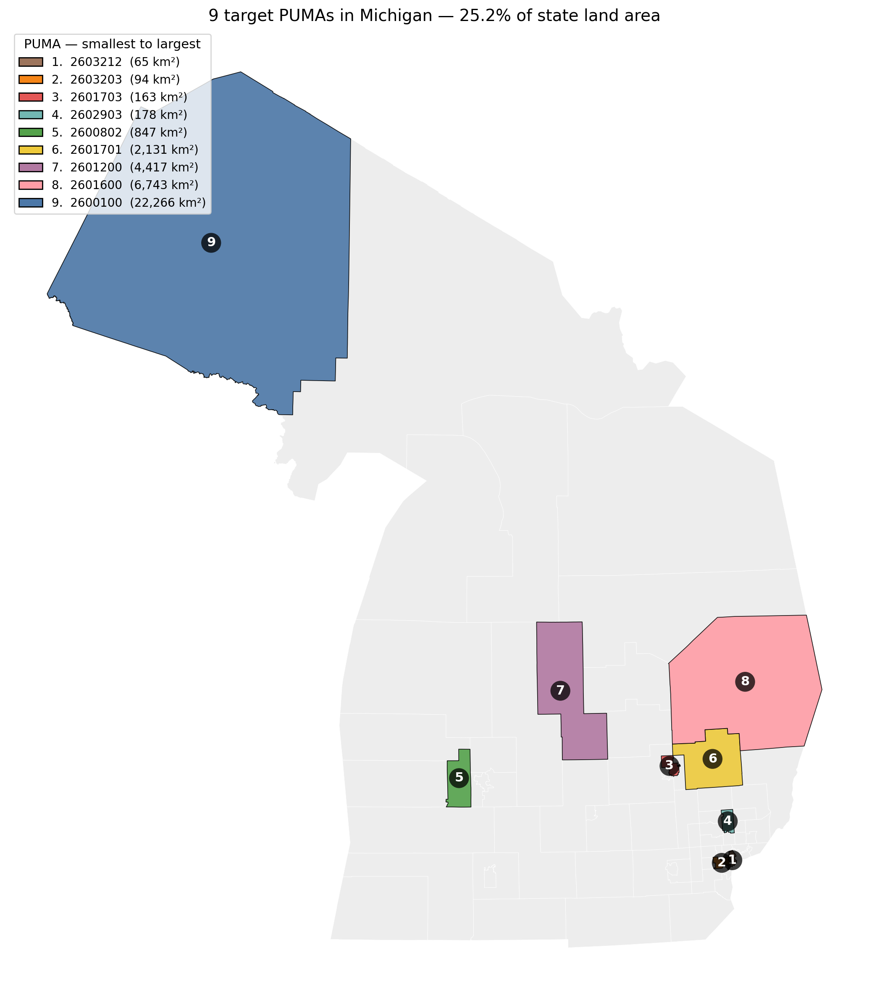

# Michigan Building Detection

Building detection from NAIP aerial imagery using a U-Net model, with PUMA- and
block-group-level estimation for survey research (NCSES small area estimation).

## Overview

This pipeline counts buildings from high-resolution NAIP aerial imagery using a
trained U-Net segmentation model, then aggregates the results to census block
group and PUMA levels. The block-group outputs are designed to link to American
Community Survey (ACS) data for small area estimation (SAE).

The work proceeds in three stages:

1. **Train / validate** the U-Net using **Microsoft Building Footprints** as ground
   truth (7,462 curated tiles).
2. **Generalization test** on Washtenaw County (a county held out of training) to
   confirm the model transfers to unseen areas.
3. **Production** — apply the model to all 9 target PUMAs and produce the building
   estimate CSVs (real estimation, no ground truth available at this scale).

- **Imagery:** NAIP (0.5–0.6 m) via the Microsoft Planetary Computer
- **Ground truth:** Microsoft Building Footprints (used for training labels and accuracy)
- **Model:** U-Net with a ResNet34 encoder; buildings counted from the predicted
  mask via connected components
- **Scope:** 9 Michigan PUMAs (urban Detroit-area through the rural Upper Peninsula)
- **Key result:** seg-only U-Net reaches tile-level MAE 1.42 and Pearson r 0.95 on the
  Washtenaw generalization test; block-group r 0.96

## Pipeline

The repository follows the processing stages in order:

| Stage | Folder | What it does |
|---|---|---|
| 1–2 | `01_data_preparation/` | Tile generation over the study area from NAIP |
| 3 | `02_data_curation/` | Curated training/validation tile dataset construction |
| — | `03_model_training/` | U-Net training |
| 4 | `04_threshold_tuning/` | Decision-threshold tuning and re-evaluation |
| 5 | `05_evaluation/` | Final evaluation vs. reference data (ACS / DHC); generalization test |
| 6 | `06_puma_estimation/` | Whole-PUMA inference and block-group aggregation |

## Results

### Per-PUMA summary (9 Michigan PUMAs)

Across the 9 target PUMAs, the model predicts **685,039 buildings**. Density spans
two orders of magnitude — from dense Detroit-area PUMAs (~750 buildings/km²) to the
sparse, mostly-forest Upper Peninsula (~5 buildings/km²).

| PUMA | Total buildings | Buildings / km² |
|---|---:|---:|
| 2600100 | 113,414 | 5.09 |
| 2600802 | 57,275 | 66.70 |
| 2601200 | 92,167 | 20.60 |
| 2601600 | 118,850 | 17.63 |
| 2601701 | 92,344 | 42.36 |
| 2601703 | 51,206 | 314.07 |
| 2602903 | 64,491 | 360.97 |
| 2603203 | 71,185 | 753.29 |
| 2603212 | 24,107 | 361.63 |


The 9 target PUMAs cover ~25.2% of Michigan's land area.
<p align="center">
  
</p>

### Model accuracy

Accuracy is measured against **Microsoft Building Footprints** as ground truth (MAE
and Pearson r compare predicted vs. footprint-derived building counts).

Trained on 7,462 curated tiles from the 9 PUMAs (seg-only U-Net, ResNet34 encoder):

| Model | IoU | MAE | Pearson r |
|---|---|---|---|
| Seg-only U-Net | 0.555 | 1.54 | 0.957 |

**Generalization test — Washtenaw County** (held out of training, 32,703 tiles):

- Tile level — MAE **1.42**, Pearson r **0.954**
- Block-group level (308 block groups) — MAE 90.13, Pearson r **0.964**

## Method

- **Tiling.** A single regular 256 m grid is laid over each PUMA polygon; a tile is
  kept when its centroid falls inside the PUMA. Each tile is assigned to the census
  block group containing its centroid. Because block groups nest cleanly within
  PUMAs, boundaries align exactly and tiles are not double-counted at PUMA edges.
- **Inference.** NAIP is searched once per PUMA (Planetary Computer STAC); each
  covering image is opened once and all its tiles are cropped from it. The U-Net
  predicts a building mask (threshold 0.5); buildings are counted as connected
  components ≥ 50 px (≈ 12.5 m²), which also defines the footprint area.
- **Reliability.** Runs are checkpointed per NAIP image group and resume after a
  disconnect; expired imagery tokens (HTTP 403) are handled with re-signing and
  retry. Open-water tiles with no NAIP coverage (e.g., the Great Lakes) are dropped.
- **Reference data.** Microsoft Building Footprints as ground truth (training labels
  and accuracy evaluation); TIGER/Line shapefiles for PUMA and block-group
  boundaries; ACS for downstream linkage.

## Data and outputs

Code lives here; **data stays in Google Drive** (`michigan_unet_project/`) because
model checkpoints, shapefiles, and result CSVs exceed GitHub's file limits.

Two CSVs are produced per PUMA in `predictions_puma/`: a tile-level file and a
block-group-level file. Full column descriptions are in
[`docs/output_data_dictionary.md`](docs/output_data_dictionary.md).

A small 9-row results summary is included in the repo
([`data/puma_building_summary.csv`](data/puma_building_summary.csv)); the full
tile- and block-group-level CSVs stay in Drive. All counts are **model predictions,
not ground-truth observations**.

## Setup

```bash
pip install -r requirements.txt
```

Notebooks are designed to run on Google Colab (GPU runtime; L4 recommended, A100 +
High-RAM for the largest PUMA). NAIP access uses a Microsoft Planetary Computer
subscription key, read from Colab Secrets — **do not hard-code it**:

```python
from google.colab import userdata
import planetary_computer as pc
pc.settings.set_subscription_key(userdata.get('PC_KEY'))
```

Add the key under Colab's "Secrets" panel as `PC_KEY` and enable notebook access.

## Repository structure

```
michigan_building_detection/
├── 01_data_preparation/     # tile generation (Phase 1-2)
├── 02_data_curation/        # curated dataset construction (pre-Phase 3 / Phase 3)
├── 03_model_training/       # U-Net training
├── 04_threshold_tuning/     # threshold tuning + re-evaluation (Phase 4)
├── 05_evaluation/           # final evaluation + generalization test (Phase 5)
├── 06_puma_estimation/      # whole-PUMA inference + aggregation
├── data/                    # 9-row PUMA results summary
├── docs/                    # data dictionary, coverage map, lessons learned
├── requirements.txt
└── README.md
```

## Notes and limitations

- **Large rural PUMAs are computationally expensive.** Processing time scales with
  land area; the largest PUMA (western Upper Peninsula, ~22,000 km²) is hundreds of
  thousands of tiles and takes many hours, run across multiple sessions.
- **Sparse areas are processed in full** rather than sampled, since scattered rural
  buildings are exactly the signal this work aims to capture.
- Building counts include non-residential structures (garages, sheds), so counts can
  exceed ACS housing-unit counts.

## Acknowledgments

Developed at the University of Michigan Institute for Social Research (ISR) for an
NCSES-funded project.
